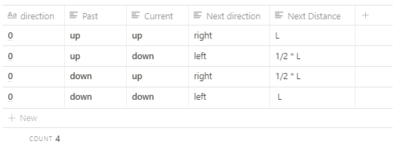
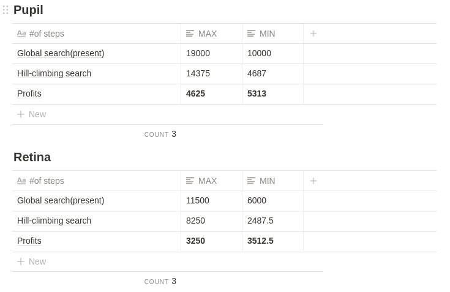

# Auto Focus Algorithm 🦄

---
 
- Background
- Hill-climbing Search
- Search Flow
- Performance
- Feedback

## Background 🐘

---

- **Global Search(Best accuracy)**

    Global search strategy goes through every possible position in unidirectional manner. This search guarantees to find optimal focus however, this is the slowest method.

- **Two-step Search(Present model)**

    Two-step search is a fast version of the Global search. This search is faster than Global but, less accurate.

- **Fibonacci Search(Second best performance)**

    Fibonacci search strategy is based on continuously narrowing the search region according to the Fibonacci sequence. The required number of iterations is also given by Fibonacci sequence.

- **Hill-climbing Search(Best performance)**

    Hill climbing search determines the direction of the next movement by the gradient of the previous two consecutive focus values. The movement step is determined by a parameter L. When the direction of the lens movement is reversed, L is reduced to one half of its original value for a finer search. (Although this search can start at any lens position, it it sensitive to image noise, and its performance depends on the chosen parameter values.)

Reference

[autofocus.pdf](Auto%20Focus%20Algorithm%20154b800e73214a2fac798579d3fc060f/autofocus.pdf)

## Hill-climbing Search 🐇

---

- **Find parameter value that minimizes motor steps**

    **#Local search #Gradient ascent/descent #Parameter L #Motor steps #Local minima/maxima**

- **Direction& Distance**
	
	

- **Code**

    https://github.com/jayden-dragon/AutoFocus/blob/master/AF_hill-climbing.go

## Search Flow 🦛

---

- **Overall Flow**

     `Start` 

        ⬇️

    `Initialize`

        ⬇️

    `Stream`

        ⬇️

    `Focusing Region Detection (get X, Y coordinate)`

        ⬇️

    `Pupil Auto-focus(two-steps search)`

        ⬇️

    `Move Z (adjust distance)`

        ⬇️

    `Retina Auto-focus(two-steps search)`

        ⬇️

     `Shot`  

        ⬇️

    `Finish`

- **Auto Focus Flow**

       `Camera`            ➡️            `Image Frame Capture` 

                                                             ⬇️                      

                                          `Focusing Region Selection` 

                                                             ⬇️

           ⬆️                                       `Strong Edge`

                                                             ⬇️ 

                                              `Contrast Measurement` 

                                                             ⬇️

`Adjust AF-axis`        ⬅️          `Search Algorithm`

                                                             ⬇️

                                             `Optimal Focused Image`

- **Hill-climbing Search Flow**

`Set parameter`

⬇️

`Get image input`

⬇️

`Get contrast`

⬇️

`Calculate slope at the current point`  

⬇️

`if slope ≥ 0`      ➡️  no      `Global search`

⬇️  yes

`Move +L`

⬇️

`Calculate slope at the next point`    ⬅️⬅️⬅️⬅️⬅️⬅️⬅️

⬇️                                                                                     ⬆️

`If next slope ≥ 0`   ➡️  no   `Move -1/2 * L` ➡️➡️➡️  ⬆️

⬇️  yes                                                                             ⬆️

`Move +L`   ➡️➡️➡️➡️➡️➡️➡️➡️➡️➡️➡️➡️➡️➡️➡️➡️ ⬆️

⬇️

`If optimal`

⬇️

`Done`

## Performance 🕊️

---

*Think of Geometric Series. If the geometric ratio is less than 1, then the geometric series must be less than 1. As a result, We can get profits of distance by changing search algorithm.

## Feedback 🦈

---

- Experimental initial point
- Optimal parameter value
- Detailed comments
- Refactory & Clean code
- We need to reduce delay_time

- reference → share my research
- bad contrast algorithm → need efficiency
- search twice at one point

---

by The Legendary Dragon 🐉